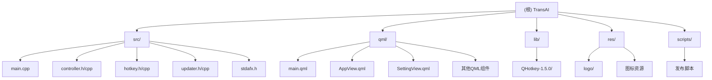

# TransAI - GPT翻译器

## 变更记录 (Changelog)

- **2025-09-26 10:57:26** - 首次架构分析，生成项目文档

## 项目愿景

TransAI是一个基于Qt/C++的跨平台GPT翻译应用程序，为用户提供快捷、准确的文本翻译服务。支持Windows、macOS和Linux三大平台，通过快捷键实现快速翻译操作。

## 架构总览

### 模块结构图



## 模块索引

| 模块 | 路径 | 语言 | 职责 |
|------|------|------|------|
| 核心应用 | / | C++/QML | 应用程序入口和配置管理 |
| 控制器 | src/ | C++ | 翻译逻辑和API通信 |
| 用户界面 | qml/ | QML | 前端界面和交互逻辑 |
| 热键功能 | src/hotkey.h/cpp | C++ | 跨平台热键和剪贴板操作 |
| 更新器 | src/updater.h/cpp | C++ | 应用程序更新检查 |
| 第三方库 | lib/ | C++ | QHotkey热键库 |

## 运行与开发

### 技术栈
- **C++17** 和 **Qt6** 作为主要开发框架
- **QML** 用于用户界面开发
- **CMake** 作为构建系统
- **OpenAI API** 提供翻译服务

### 构建要求
- CMake 3.16+
- Qt6 Quick
- 支持的操作系统：Windows、macOS、Linux

### 构建命令
```bash
mkdir build
cd build
cmake ..
make
```

### 功能特性
- 快捷键翻译：支持自定义快捷键，选中文本即可翻译
- 多语言支持：支持翻译到多种语言（简体中文、繁体中文、英语、日语、德语、韩语、西班牙语、法语）
- 实时翻译：基于OpenAI API的流式翻译
- 系统托盘：支持系统托盘图标和菜单
- 自动更新：内置更新检查功能
- 跨平台支持：Windows、macOS、Linux全平台支持

## 测试策略

项目目前没有自动化测试框架，主要依赖手动测试：
- 界面交互测试
- 翻译功能测试
- 热键功能测试
- 跨平台兼容性测试

## 编码规范

- 文件编码：UTF-8
- 代码风格：遵循Qt官方代码风格
- 属性定义：使用自定义的Q_PROPERTY_AUTO宏
- 信号槽：使用Qt的新式信号槽语法
- 内存管理：使用Qt的父子对象管理机制

## AI 使用指引

### 主要AI集成点
1. **翻译API调用** - 通过OpenAI API进行文本翻译
2. **翻译模式** - 支持基础翻译、词典翻译和语法纠正三种模式
3. **流式响应** - 实时显示翻译结果

### 配置参数
- API服务器地址（默认：https://api.openai.com）
- API密钥
- 模型名称（默认：gpt-3.5-turbo）
- 快捷键设置

### 安全考虑
- API密钥存储在本地配置文件中
- 网络请求使用HTTPS加密
- 错误处理包含网络错误类型识别

## 相关文件清单

### 核心源文件
- `src/main.cpp` - 应用程序入口
- `src/controller.h/cpp` - 翻译控制器
- `src/hotkey.h/cpp` - 热键功能
- `src/updater.h/cpp` - 更新检查器
- `src/stdafx.h` - 宏定义和工具函数

### 界面文件
- `qml/main.qml` - 主窗口
- `qml/AppView.qml` - 翻译界面
- `qml/SettingView.qml` - 设置界面
- `qml/*.qml` - 其他UI组件

### 配置文件
- `CMakeLists.txt` - CMake构建配置
- `TransAI.qrc` - Qt资源文件
- `.gitignore` - Git忽略规则

### 资源文件
- `res/logo/` - 应用程序图标
- `res/*.png` - 界面图标资源

### 构建和发布
- `scripts/` - 发布脚本
- `build/` - 构建输出目录（被忽略）