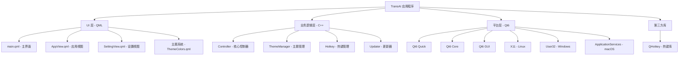

# TransAI 项目文档

> 🤖 AI驱动的智能翻译桌面应用程序 | 基于 Qt6 + C++

## 项目概览

TransAI 是一个跨平台的桌面翻译应用，使用 Qt6 Quick 框架和 C++ 开发，具备现代化的用户界面和高效的处理能力。项目支持 Linux、Windows 和 macOS 平台。

**当前版本**: v0.1

## 架构总览


```mermaid
graph TD
    A[TransAI 应用程序] --> B[UI 层 - QML]
    A --> C[业务逻辑层 - C++]
    A --> D[平台层 - Qt6]
    A --> E[第三方库]

    B --> B1[main.qml - 主界面]
    B --> B2[AppView.qml - 应用视图]
    B --> B3[SettingView.qml - 设置视图]
    B --> B4[主题系统 - ThemeColors.qml]

    C --> C1[Controller - 核心控制器]
    C --> C2[ThemeManager - 主题管理]
    C --> C3[Hotkey - 热键管理]
    C --> C4[Updater - 更新器]

    D --> D1[Qt6 Quick]
    D --> D2[Qt6 Core]
    D --> D3[Qt6 GUI]
    D --> D4[X11 - Linux]
    D --> D5[User32 - Windows]
    D --> D6[ApplicationServices - macOS]

    E --> E1[QHotkey - 热键库]
```

## 模块索引

### 📁 核心模块

| 模块路径 | 类型 | 描述 | 关键文件 |
|---------|------|------|----------|
| [`src/`](src) | 核心业务 | C++源代码，包含控制器和业务逻辑 | controller.cpp/h, ThemeManager, Hotkey, Updater |
| [`qml/`](qml) | 用户界面 | QML用户界面文件，现代化UI组件 | main.qml, AppView.qml, SettingView.qml |
| [`lib/`](lib) | 外部依赖 | 第三方库和自定义库 | QHotkey-1.5.0 |
| [`tests/`](tests) | 测试 | 单元测试文件 | test_thememanager.cpp |
| [`res/`](res) | 资源 | 图像、图标、主题资源 | logo, images, icons |

### 📁 文档模块

| 模块路径 | 类型 | 描述 | 覆盖内容 |
|---------|------|------|----------|
| [`docs/architecture/`](docs/architecture) | 架构设计 | 项目架构文档 | 整体架构、技术实现、性能优化、安全考虑 |
| [`docs/prd/`](docs/prd) | 产品需求 | 产品需求文档 | Epic列表、用户故事、需求说明 |
| [`docs/qa/gates/`](docs/qa/gates) | 质量保证 | QA测试门禁 | 自动化测试标准 |
| [`docs/stories/`](docs/stories) | 用户故事 | 具体实现故事 | 主题系统、输入优化、窗口管理 |

### 📁 构建模块

| 模块路径 | 类型 | 描述 |
|---------|------|------|
| [`scripts/`](scripts) | 构建脚本 | Windows 发布脚本 |
| `CMakeLists.txt` | 构建配置 | CMake 主构建文件 |
| `lib/CMakeLists.txt` | 库构建 | QHotkey 库构建配置 |

## 技术栈

- **UI框架**: Qt6 Quick (QML)
- **编程语言**: C++17
- **构建系统**: CMake 3.16+
- **热键库**: QHotkey 1.5.0
- **平台支持**: Linux / Windows / macOS

## 构建与运行

### 依赖要求
- Qt6.5+ (推荐 6.9.2)
- CMake 3.16+
- C++17 编译器

### Linux 构建
```bash
cmake -B build -DCMAKE_BUILD_TYPE=Release
cmake --build build
./build/TransAI
```

### Windows 构建
```powershell
# 使用 PowerShell 脚本
./scripts/windows-publish.ps1
```

## 代码规范

### C++ 代码风格
- 遵循 C++ Core Guidelines
- 使用 RAII 管理资源
- 智能指针替代原生指针
- 模块化设计，单一职责原则

### QML 组件规范
- 组件化开发，模块化复用
- 主题系统统一管理视觉风格
- 响应式设计，自适应布局
- 信号槽机制处理组件通信

### 目录结构规范
```
src/           # C++ 源文件
├── *.cpp      # 实现文件
├── *.h        # 头文件
└── theme/     # 主题相关代码
qml/           # QML 界面文件
├── *.qml      # 界面组件
└── qmldir     # 模块声明
lib/           # 第三方库
tests/         # 单元测试
docs/          # 项目文档
res/           # 资源文件
scripts/       # 构建脚本
```

## 核心组件

### 1. Controller (控制器)
**路径**: `src/controller.cpp/h`
**职责**: 应用核心控制器，管理应用状态和业务逻辑

### 2. ThemeManager (主题管理)
**路径**: `src/theme/ThemeManager.cpp/h`
**职责**: 管理应用主题，包括深色/浅色主题切换

### 3. Hotkey (热键管理)
**路径**: `src/hotkey.cpp/h`
**职责**: 全局热键注册和管理

### 4. Updater (更新器)
**路径**: `src/updater.cpp/h`
**职责**: 应用更新检测和下载

### 5. QML 界面组件
- **main.qml**: 应用主入口
- **AppView.qml**: 主要应用视图
- **SettingView.qml**: 设置页面
- **ThemeColors.qml**: 主题颜色定义

## 质量保证

### 测试覆盖
- 单元测试: `tests/test_thememanager.cpp`
- 构建系统测试: CMake 验证
- 平台兼容性测试: Linux/Windows/macOS

### 代码质量工具
- CMake 自动代码生成 (MOC, RCC, UIC)
- Qt6 严格策略检查 (QTP0001)
- C++ 静态分析建议

## 项目状态

### ✅ 已完成功能
- [x] 基础应用框架
- [x] 主题系统实现
- [x] 输入框交互优化
- [x] 自动关闭翻译窗口
- [x] 跨平台支持 (Linux/Windows/macOS)
- [x] QHotkey 集成

### 📋 待实现功能
- [ ] 翻译API集成
- [ ] 高级主题自定义
- [ ] 翻译历史记录
- [ ] 多语言支持增强
- [ ] 性能优化

## 开发指南

### 添加新功能步骤
1. 在 `src/` 中添加对应的 C++ 类
2. 在 `qml/` 中创建对应的 QML 界面
3. 在 `tests/` 中添加单元测试
4. 更新 `docs/` 中的相关文档
5. 更新 `CMakeLists.txt` 构建配置

### 修改主题系统
1. 修改 `src/theme/ThemeManager.cpp` 逻辑
2. 更新 `qml/ThemeColors.qml` 颜色定义
3. 验证 `tests/test_thememanager.cpp` 测试通过

### 界面开发
1. 在 `qml/` 中创建新组件
2. 使用信号槽与 C++ 控制器通信
3. 遵循现有组件设计模式
4. 更新 `qml/qmldir` 模块声明

## 相关资源

- [Qt6 文档](https://doc.qt.io/qt-6/)
- [CMake 文档](https://cmake.org/documentation/)
- [QML 教程](https://doc.qt.io/qt-6/qml-tutorial.html)

---

**最后更新**: 2025-11-07 13:24:09
